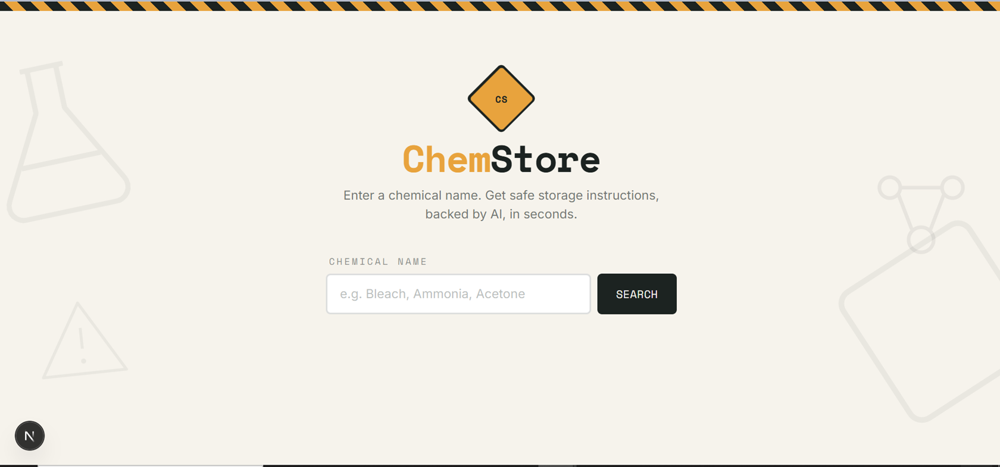
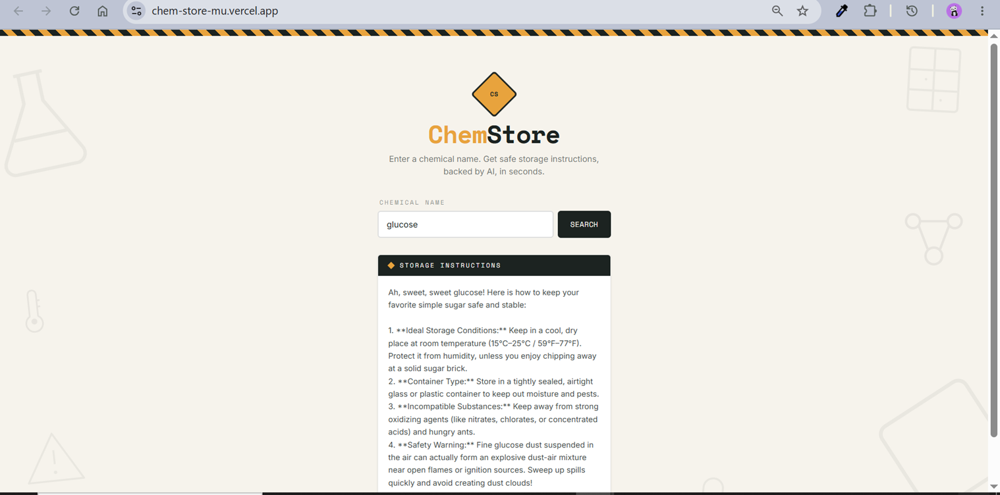
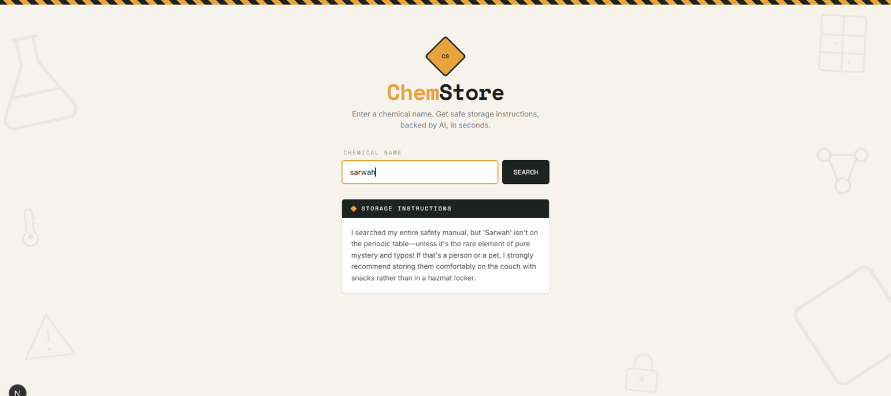

# ChemStore

> 🎓 Final project submitted for a course.

**ChemStore** is an AI-powered chemical storage safety assistant. Enter the name of any household or lab chemical, and it instantly returns clear, structured, beginner-friendly instructions for how to store it safely — ideal conditions, container type, incompatible substances, and safety warnings. If you enter something that *isn't* a chemical, it responds with a witty, kind, chemistry-themed joke instead of a generic error.

## 🌐 Live Demo

**[https://chem-store-mu.vercel.app](https://chem-store-mu.vercel.app)**

## 💡 Problem Solved

Improper chemical storage is a common and preventable safety hazard — at home and in labs. Most people don't know that bleach and ammonia should never be stored near each other, or that certain solvents need to be kept away from heat and light. ChemStore removes the guesswork: type in a chemical name and get instant, structured, easy-to-follow safety guidance, powered by AI — no manual lookup or chemistry background required.

## ✨ Features

- **Instant AI-generated storage instructions** for real chemicals, structured into four clear parts: ideal storage conditions, container type, substances to avoid, and safety warnings
- **Witty non-chemical detection** — if you type something that isn't a storable chemical (a random word, an object, even your own name), the app responds with a genuinely funny, kind-hearted joke instead of breaking or showing a generic error
- **Hazard-placard themed UI** — cream background, amber/ink hazard-diamond color scheme, hazard-stripe top bar, and faint background icons (flask, molecule, warning triangle, storage cabinet, thermometer, padlock) for an on-brand chemical-safety look
- **Clear loading and error states** for a smooth user experience
- **Fully responsive**, built with Tailwind CSS

## 🤖 AI Feature & System Prompt

The core AI feature is a Next.js API route (`app/api/chemical/route.ts`) that calls the Gemini API directly via `fetch` to generate storage instructions or a joke, depending on the input. The exact system prompt used:

```
You are ChemStore, a witty safety assistant that gives clear instructions for how to SAFELY STORE household, camping, or lab chemicals.

Rules:
- If the input IS a real chemical or storable substance, follow this structure: (1) Ideal storage conditions (temperature, light, humidity), (2) Container type, (3) What NOT to store it near (incompatible substances), (4) A brief safety warning if relevant. Keep it clear, structured, and beginner-friendly, under 150 words.
- Formatting: plain text only. Never use LaTeX, markdown math notation, or symbols like $, \text, \circ, or backslash commands. Write temperatures and numbers in plain readable text, e.g. "15–25°C (59–77°F)" — no dollar signs, no special math syntax of any kind.
- If the input is NOT a chemical or storable substance (e.g. a random word, an object, a feeling, a person, nonsense text), do NOT give storage instructions. Instead, be genuinely funny — like a witty friend teasing them, not a generic chatbot apology. Use wordplay, chemistry puns, or a playful exaggerated reaction. Make it feel spontaneous and a little silly, not templated. Keep it to 1-2 sentences, always kind-hearted, never mean or condescending.
- Examples of the right energy (write NEW jokes each time, don't reuse these): "My homework" → "I store chemicals, not procrastination — though both can be volatile." "Pizza" → "Store that in your stomach, not a chemical cabinet. Extra cheese is not a hazard class." "My ex" → "That one's combustible for sure, but I don't have a shelf for it."
- Never break character or mention that you are an AI model.
```

## 🛠️ Tools & Tech Used

- **Next.js** (App Router) — framework
- **TypeScript** — type safety
- **Tailwind CSS** — styling
- **Gemini API** — AI-generated storage instructions and jokes, called via direct `fetch` (not the SDK)
- **next/font/google** — Space Mono (display font) + Inter (body font)
- **Vercel** — hosting and deployment
- **GitHub** — version control

## 📸 Screenshots

**Homepage**



**Real Chemical Result (Glucose)**



**Witty Non-Chemical Result**



## 🚀 How to Run Locally

1. Clone the repository
   ```bash
   git clone https://github.com/sarwah-nadeem/ChemStore.git
   cd ChemStore
   ```

2. Install dependencies
   ```bash
   npm install
   ```

3. Add your Gemini API key
   Create a `.env.local` file in the project root with:
   ```
   GEMINI_API_KEY=your_api_key_here
   ```
   Get a free API key at [aistudio.google.com/apikey](https://aistudio.google.com/apikey)

4. Run the development server
   ```bash
   npm run dev
   ```

5. Open [http://localhost:3000](http://localhost:3000) in your browser
